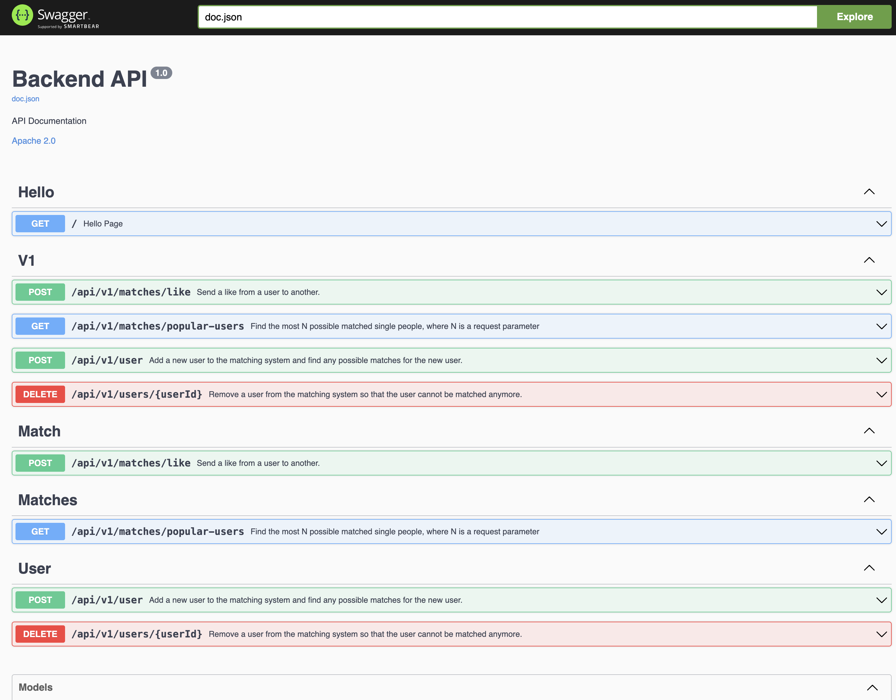

# Bito OA By AllenKao

## Build & run
```shell
$ make all
```

## Build docker image
```shell
$ docker-compose -f ./build/docker-compose.yaml build
```

## Run as docker
```shell
$ docker-compose -f ./build/docker-compose.yaml up
```

## API documentation

Once server start, visit http://localhost:8080/swagger/index.html#/

<p >
  
</p>

## System design

- DI: wire
- Framework: gin
- Logger: zap
- Architecture: controller -> service (interface and implementation) -> repo (interface and implementation)
- Definition of popular user: how much the user being liked

## API time complexity

- POST /api/v1/user: O(n)
  - O(1) for insert, O(n) for find candidates.
- DELETE /api/v1/users/{userId}: O(1)
- GET /api/v1/matches/popular-users: O(nlogn)
  - Sort users by popularity: O(nlogn)
- POST /api/v1/matched/like: O(1)

## TBD

- Remove User
    - Remove the user from DB (current approach)
    - Set user date limit to 0
    - Block the user